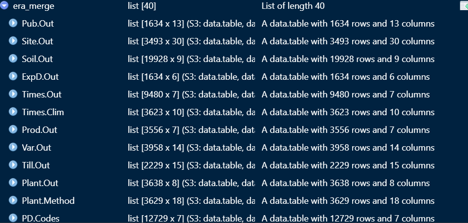
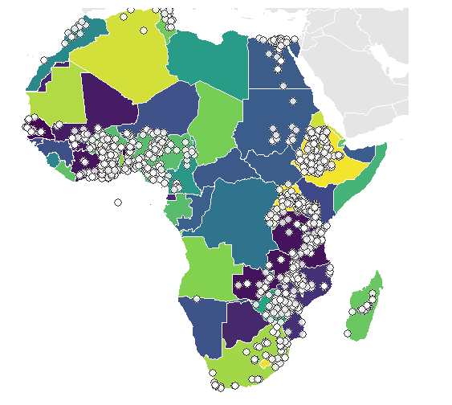
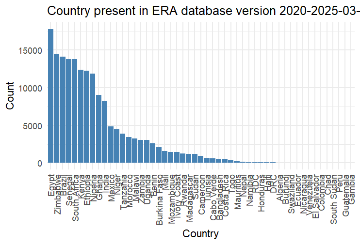
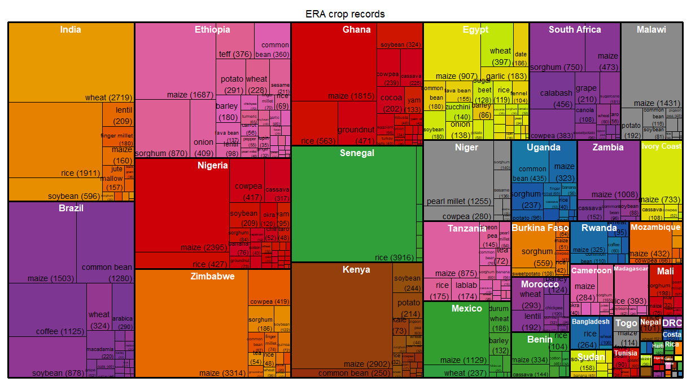

---
html_document:
  toc: true
  toc_float: true
  code_folding: hide
output: pdf_document
---
# ERA Report 

## Transforming ERA data into the CAROB standard

---

**Table of content:**
---

1. [ERA data Description](#1--era-data-description)
2. [Structure of ERA data](#2--structure-of-era-data)
3. [Exploring ERA data](#3-exploring-era-data-base)
4. [Integretting ERA into Carob database](#4-integretting-era-into-carob-database)
5. [Recommendation](#5-recommendation)

 # 1- ERA data Description 

ERA provides a large, structured meta-dataset of agricultural experiments, harmonized using a common data model and controlled vocabulary. The data comes from peer-reviewed agricultural studies conducted in Africa between 1934 and 2022. (<a href="https://eragriculture.github.io/ERA_Agronomy/ERA-User-Guide.html">ERA-User-Guide</a>)

### Data Records

ERA database content:

- More than 400 variables ( some might not be important depending of use of the dataset)

- More than 202,000 observations from different areas

- The data is extracted from 1720 peer-reviewed studies. 

- The data is from 51 countries.  

It's a huge database of quality with enough information on agronomic practices and crop management.

# 2- Structure of ERA data

Once the dataset is downloaded, it appears in multiple tables. Each table contains specific information from different papers.
Each of the tables is related to the others through a common piece of information, allowing to compile all of them together and get a larger database with the desired variables.

The dataset appears as shown in this screenshot below.

After exploring all the tables, the data in general is structured as follows:

 - Each study present in the database is identified by the key code (B.Code).

- To establish a link between the tables, the primary key in each table must be used. 

  After compiling all the tables, you should select:

 - Product type: The user should select the type of product experiment to study (e.g., plant or animal).

 - Output: ERA offers data from different categories of output: `Productivity`, `Resilience`, and `Mitigation`, unlike CAROB, where the data is mainly from `Productivity`. The `Resilience` and `Mitigation` categories are not yet recorded in Carob.

- Soil variables are recorded in the long format and need to be transformed into the wide format to meet the CAROB standard structure.

- There is a column named `meanT` that contains all the response variables (yield, biomass, crop price, etc.). 

# 3. Exploring ERA data base

## 3.1 Geographic location

The dataset contains data from 1,753 locations across 51 countries , distributed as shown in the Histogram graph below.

Most of the points are from African countries, as shown the Africa Map below. The  distribution of points across countries can also be seen.

  
  

## 3.2 Crop records in ERA

The ERA data contains a wide number of crops recorded from different locations distributed across the country, as shown in the plot below. 

# 4. Integretting ERA into Carob database

The structure of ERA data and CAROB are completely different; it needs major treatment to meet the CAROB standard. However, ERA seems to be of higher quality, as it is extracted from peer reviews and is therefore a very important database that could be used for many purposes.

To integrate ERA into Carob, some complementary check are needed. 

- Vocabulary check: Identify the common variables in CAROB and in ERA. Once this is done, the ERA variables can then be transformed into a CAROB standard (`terminage`). 

- Data type check (character, numeric, integer etc..) : Compare the data type of both data base and convert into the Carob standard type

- Unit check: Check the units of the ERA numeric-type variable and convert them into the Carob standard unit. 

- Terms check: This refers to the content of variables. Carob has standard content for variables. The content of ERA variables must therefore be standardized in order to meet Carob's standard requirements. 

All this has been done by writing an R script (<a href="https://github.com/cedricngakou/era-carob/blob/main/script/era_carob.R">github.com/cedricngakou/era-carob/blob/main/script/era_carob.R </a>) to compile the different tables, explore, transform, extract relevant variables, and standardize them into a CAROB standard. 

To select the relevant variables from ERA to CAROB, comparative tables have been made in order to facilitate the process. This can be found here. (<a href="https://github.com/cedricngakou/era-carob/blob/main/ERA_data/comparative_table.csv">comparative_table.csv</a>)

# 5. Recommendation

The ERA data has very high potential for agronomy data-driven decision-making. Compared to CAROB, where there is a large number of observations, ERA data has fewer observations but is characterized by its high quality due to provenance. Therefore, ERA data could have multiple roles in CAROB processes.     

- ERA data can be used as reference data for quality checks (to verify the bounds of some variables). 

- Its can be directly joined to Carob compiled data for general use. 

- Will help to improve terms and vocabulary in Carob, as it shows a wide range of terms used in agronomy that might not yet be integrated into the Carob standard.

