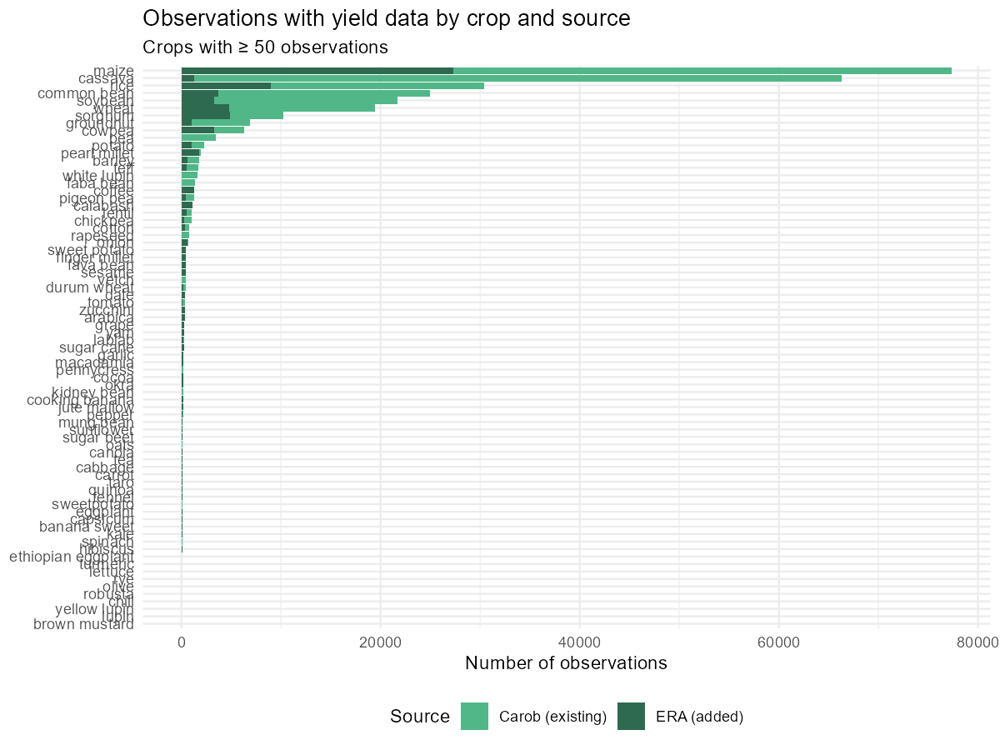
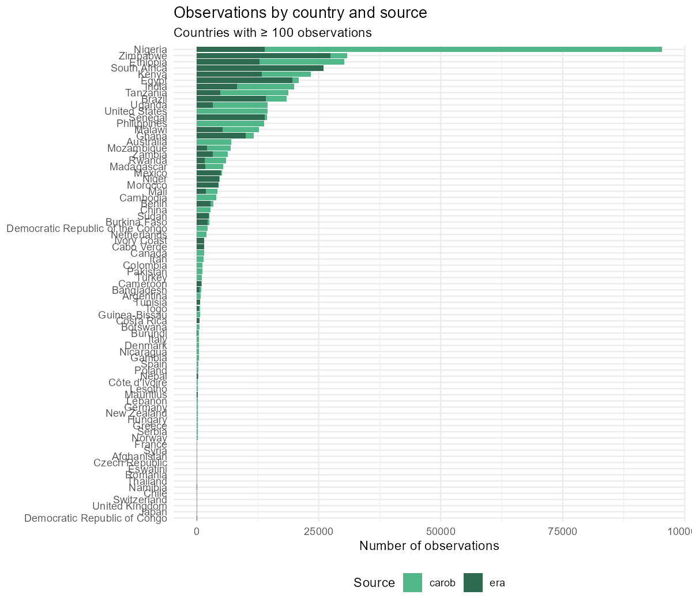
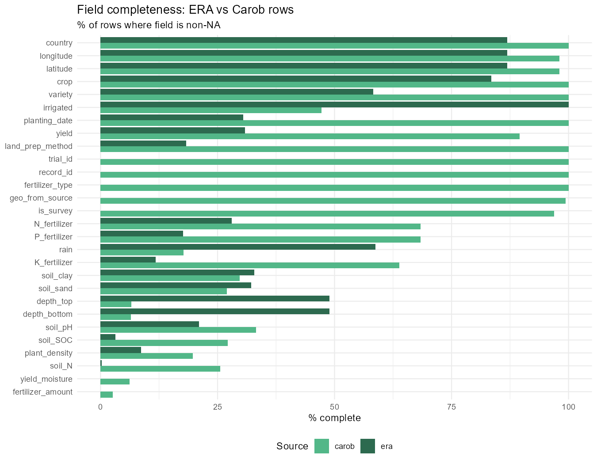

ERA × Carob
================

- [ERA → Carob: Transforming ERA Agronomic Data into the Carob Standard
  Format](#era--carob-transforming-era-agronomic-data-into-the-carob-standard-format)
  - [What is ERA?](#what-is-era)
  - [What is Carob?](#what-is-carob)
  - [Scripts](#scripts)
  - [Coverage Report](#coverage-report)
  - [`era_carob.R` — ERA to Carob
    format](#era_carobr--era-to-carob-format)
  - [`era_carob_merge.R` — Deduplication, schema alignment,
    merge](#era_carob_merger--deduplication-schema-alignment-merge)
  - [Known limitations and future
    work](#known-limitations-and-future-work)

# ERA → Carob: Transforming ERA Agronomic Data into the Carob Standard Format

This repository contains R scripts that load the ERA agronomic database,
reformat it to match the [Carob](https://carob-data.org) data standard,
and merge it with the existing Carob dataset to create a unified
meta-analysis resource.

------------------------------------------------------------------------

## What is ERA?

ERA (Evidence for Resilient Agriculture) is a peer-reviewed agronomic
database maintained by CGIAR. It contains over 110,000 observations from
~1,720 studies across 51 countries, covering crops, soils, management
practices, and yield outcomes.

## What is Carob?

Carob is an open agricultural data platform that standardises
experimental datasets into a common schema (~238,000 observations, ~197
datasets).

------------------------------------------------------------------------

## Scripts

| Script                      | Purpose                          | Output    |
|-----------------------------|----------------------------------|-----------|
| `script/era_carob.R`        | Transform ERA → Carob format     | `dwf`     |
| `script/era_carob_merge.R`  | Deduplicate, align schema, merge | `merged`  |
| `script/era_carob_report.R` | Coverage report + visualisations | `report/` |

Run in order: `era_carob.R` → `era_carob_merge.R` → `era_carob_report.R`

Then re-knit this file to update the README:

``` r
rmarkdown::render("README.Rmd")
```

------------------------------------------------------------------------

## Coverage Report

### What ERA added to Carob

| Metric                       |  Value |
|:-----------------------------|-------:|
| ERA observations added       | 244094 |
| ERA studies added            |   1720 |
| ERA studies already in Carob |     21 |
| New countries from ERA       |     17 |
| New crops from ERA           |    678 |
| Total observations (merged)  | 491087 |
| Total columns (merged)       |    321 |

### Studies already in both ERA and Carob

**21** ERA studies were already present in Carob (matched on journal
DOI):

| ERA dataset ID | Journal DOI                 | 
| AG0065         | 10.3389/fpls.2016.01435     | 
| AN0132         | 10.1017/S0014479715000265   | 
| CJ0026         | 10.1017/S1742170517000606   | 
| CJ0026         | 10.1017/S1742170517000606   | 
| DK0015         | 10.1155/2018/7676058        | 
| DK0061         | 10.1016/j.fcr.2017.01.024   | 
| DK0071         | 10.1016/j.agee.2017.08.015  | 
| DK0071         | 10.1016/j.agee.2017.08.015  | 
| DK0071         | 10.1016/j.agee.2017.08.015  | 
| DK0076         | 10.1016/j.agee.2016.05.012  | 
| DK0076         | 10.1016/j.agee.2016.05.012  | 
| DK0076         | 10.1016/j.agee.2016.05.012  | 
| EO0151         | 10.1016/j.fcr.2015.02.013   | 
| HK0261         | 10.2134/agronj2012.0063     | 
| JO0038         | 10.1016/j.agee.2022.108207  | 
| JO0038         | 10.1016/j.agee.2022.108207  | 
| JO0042         | 10.1016/j.fcr.2020.108052   | 
| NM0013         | 10.1016/j.fcr.2021.108225   | 
| NM0013         | 10.1016/j.fcr.2021.108225   | 
| NM0101         | 10.1016/j.agee.2021.107576  | 
| NN0560         | 10.1016/j.agwat.2011.04.002 | 

### Observations by crop



### Observations by country



### Field completeness: ERA vs Carob



### Fields with 0% completeness in ERA rows

These Carob fields have no equivalent in ERA and will always be `NA` for
ERA-sourced rows:

- `record_id`
- `trial_id`
- `is_survey`
- `yield_moisture`
- `geo_from_source`
- `fertilizer_type`
- `fertilizer_amount`

### Fields with \<25% completeness in ERA rows

| Field            | % complete in ERA rows |
|:-----------------|-----------------------:|
| soil_N           |                    0.2 |
| soil_SOC         |                    3.2 |
| plant_density    |                    8.7 |
| K_fertilizer     |                   11.8 |
| P_fertilizer     |                   17.6 |
| land_prep_method |                   18.3 |
| soil_pH          |                   21.0 |

### ERA-only columns dropped during merge

| Category            | N columns | Examples                                                 |
|:--------------------|----------:|:---------------------------------------------------------|
| Economic outcomes   |        28 | Variable_Cost, Gross_Margin, Benefit_Cost_Ratio\_(GMVC)  |
| ERA climate fields  |         2 | total_prec, seasonal_prep                                |
| ERA internal fields |         4 | dsign, control_T, treatment_type, id                     |
| Unmapped outcomes   |        47 | Land_Equivalent_Ratio, Biomass_Yield, Crop_Residue_Yield |
| Other               |        27 | uri, year, herbicide_method                              |

------------------------------------------------------------------------

## `era_carob.R` — ERA to Carob format

<details>
<summary>
<strong>Step 1 — Data loading</strong>
</summary>

ERA data is loaded from a public S3 bucket (`s3://digital-atlas/era`)
rather than a local file. The script: - Finds the latest
`era_agronomy_bundle_*.tar.gz` in the S3 bucket - Downloads and extracts
it to `downloaded_data/` (only if not already present — cached) - Loads
three files: - `agronomic_*.json` → `era_merge` (the relational table
list) - `era_master_codes*.json` → `era_master` (vocabulary/lookup
codes) - `era_compiled*.parquet` → `ERA_Compiled` (compiled flat table)

> `downloaded_data/` is in `.gitignore` — the bundle is too large (~473
> MB) for GitHub.

</details>
<details>
<summary>
<strong>Step 2 — Merging ERA sub-tables</strong>
</summary>

ERA stores data across 12 relational sub-tables merged into a single
flat data frame `rb`:

| Sub-table              | Content                                             |
|------------------------|-----------------------------------------------------|
| `Data.Out`             | Core outcome and site data (baseline)               |
| `Prod.Out`             | Production/yield variables                          |
| `Till.Out`             | Tillage method and mechanisation                    |
| `Plant.Method`         | Planting density, method, row spacing               |
| `Fert.Method`          | Fertilizer type, amount, timing                     |
| `Chems.Out`            | Herbicides, insecticides, fungicides, biopesticides |
| `Res.Method`           | Residue management                                  |
| `Res.Comp`             | Residue composition                                 |
| `pH.Out` / `pH.Method` | Soil pH measurements and method                     |
| `Irrig.Method`         | Irrigation amount, method, dates                    |
| `WH.Out`               | Water harvesting                                    |
| `Soil.Out`             | Soil properties (long → wide per study)             |

**Filtering:** rows with `Site.ID == "All Sites"` and
`Product.Type == "Animal"` are removed.

</details>
<details>
<summary>
<strong>Step 3 — Variable selection and renaming</strong>
</summary>

The merged table `rb` has 400+ ERA-specific column names. The script
builds a new data frame `d` mapping ERA columns to Carob names:

| ERA column                    | Carob column                                                    | Notes                                                            |
|-------------------------------|-----------------------------------------------------------------|------------------------------------------------------------------|
| `B.DOI`                       | `uri`                                                           | Journal article DOI                                              |
| `B.Author.Last`               | `reference`                                                     | Last name of first author                                        |
| `B.Code`                      | `dataset_id`                                                    | ERA study code                                                   |
| `Site.ID`                     | `location`                                                      | Site name                                                        |
| `Site.Type`                   | `on_farm`                                                       | On-farm vs research station                                      |
| `Site.LatD` / `Site.LonD`     | `latitude` / `longitude`                                        | Truncated to 6 chars before cleaning                             |
| `Site.MAP`                    | `rain`                                                          | Mean annual precipitation                                        |
| `Site.Elevation`              | `elevation`                                                     |                                                                  |
| `Site.Soil.Texture`           | `soil_type`                                                     |                                                                  |
| `Time.Clim.Temp.Mean/Max/Min` | `temp` / `tmax` / `tmin`                                        | ERA-specific — not in Carob schema                               |
| `Time.Clim.SP`                | `seasonal_prep`                                                 | ERA-specific — not in Carob schema                               |
| `EX.Design`                   | `dsign`                                                         | Experimental design                                              |
| `P.Product`                   | `crop`                                                          | Crop species                                                     |
| `T.Name` / `F.Level.Name`     | `treatment`                                                     | Falls back to fertilizer level name if treatment name is missing |
| `T.Control`                   | `control_T`                                                     | TRUE/FALSE control flag                                          |
| `F.NI`                        | `N_fertilizer`                                                  | Inorganic N                                                      |
| `F.PI` / `F.P2O5`             | `P_fertilizer`                                                  | Uses P2O5 if PI is missing                                       |
| `F.KI` / `F.K2O`              | `K_fertilizer`                                                  | Uses K2O if KI is missing                                        |
| `I.Amount`                    | `irrigation_amount`                                             | Fixed: was incorrectly assigned `I.Method`                       |
| `I.Method`                    | `irrigation_method`                                             | Added — was missing from original script                         |
| `Plant.Density`               | `plant_density`                                                 | Split into `seed_density` / `seed_rate` based on units           |
| `C.Type` + `C.Amount` etc.    | `herbicide_*` / `insecticide_*` / `fungicide_*` / `pesticide_*` | Detected from `C.Type` using `grepl`                             |

</details>
<details>
<summary>
<strong>Step 4 — Seed density unit standardisation</strong>
</summary>

ERA stores planting density with a separate units column. The script
splits into three Carob fields:

- `seed_density` — seeds or kg seed per ha (converted from per m² ×
  10,000 where needed)
- `seed_rate` — kg/ha seeding rate
- `plant_density` — plants per ha (converted from per m² × 10,000 where
  needed)

**Decision:** Once a row is classified into `seed_density` or
`seed_rate`, `plant_density` is set to NA to avoid double-counting. The
`units` column is then dropped.

</details>
<details>
<summary>
<strong>Step 5 — Country name cleaning</strong>
</summary>

ERA stores some country values as combined strings. The script resolves
these via a hardcoded `ifelse` chain:

| ERA value           | Resolved to                      |
|---------------------|----------------------------------|
| `"Benin..Togo"`     | `"Benin"`                        |
| `"Ghana..Benin"`    | `"Ghana"`                        |
| `"Kenya..Kenya"`    | `"Kenya"`                        |
| `"Drc"` / `"Congo"` | `"Democratic Republic of Congo"` |

> **Known limitation:** Only a subset of multi-country strings are
> handled. Unmatched values pass through unchanged.

</details>
<details>
<summary>
<strong>Step 6 — Intercrop parsing</strong>
</summary>

ERA stores intercrop species as `***`-delimited strings
(e.g. `"Maize***Beans***Sorghum"`). The script splits these,
standardises a small number of long scientific names
(e.g. `"Mangifera indica"` → `"Mangifera"`), and rejoins with `;` as the
Carob separator.

</details>
<details>
<summary>
<strong>Step 7 — Organic matter flag</strong>
</summary>

`OM_used` is set to `TRUE` if any of `N_organic`, `P_organic`, or
`K_organic` is non-zero. This is a derived binary flag not present in
the raw ERA data.

</details>
<details>
<summary>
<strong>Step 8 — Coordinate cleaning</strong>
</summary>

Latitude and longitude values in ERA sometimes contain multiple decimal
points (e.g. `"1.23.45"`). The cleaning pipeline: 1. Truncates to 6
characters 2. Removes extra decimal points (keep only the first) 3.
Applies `carobiner::fix_name()` to handle encoding artefacts 4. Strips
trailing dots 5. Converts to numeric

</details>
<details>
<summary>
<strong>Step 9 — Fertilizer value cleaning</strong>
</summary>

N, P, and K fertilizer values can contain concatenated strings, NA
artefacts, and sentinel values. Per nutrient: 1. `carobiner::fix_name()`
— fixes encoding 2. Remove `NA.` / `.NA` artefacts 3. Replace multiple
dots with spaces 4. Replace ERA sentinel values `999` / `999999` with
`NA` 5. Extract first space-delimited token and convert to numeric

> **Fixed bug:** The original script used `substr(..., 1, 3)` which
> truncated values ≥ 1000 (e.g. 1200 → 120). Replaced with
> `gsub("\\s.*", "")`.

</details>
<details>
<summary>
<strong>Step 10 — Long-to-wide pivot (response variables)</strong>
</summary>

ERA stores outcome variables in long format. The script pivots to wide
format per study using `proc()`, then renames key columns:

| ERA variable name              | Carob column   |
|--------------------------------|----------------|
| `Crop_Yield`                   | `yield`        |
| `Soil_Organic_Carbon`          | `soil_SOC`     |
| `Soil_Total_Nitrogen`          | `soil_total_N` |
| `Soil_Nitrogen`                | `soil_N`       |
| `Soil_Organic_Matter`          | `soil_SOM`     |
| `Carbon_Dioxide_Emissions`     | `soil_CO2`     |
| `Soil_Organic_Carbon_(Change)` | `soil_ex_SOC`  |

</details>
<details>
<summary>
<strong>Step 11 — Land preparation method harmonisation</strong>
</summary>

Harmonised from ERA free-text codes to a controlled vocabulary.
Fallback: if `T.Method` is missing, `Till.Other` is used.

| ERA codes matched             | Carob value         |
|-------------------------------|---------------------|
| `CT`, `CONV`, `Conventional`  | `"conventional"`    |
| `NT`, `ZT`, `No-till`, `zero` | `"zero tillage"`    |
| `MT`, `Min Till`              | `"minimum tillage"` |
| `RT`, `reduced`               | `"reduced tillage"` |
| `Ridge`, `Ridging`            | `"ridge tillage"`   |
| `Hand Hoe`, `hoe`             | `"hoeing"`          |
| `Plough`, `Ploughed`          | `"ploughing"`       |
| `Basins`, `BASINS`            | `"basins"`          |
| `puddled plots`               | `"puddled"`         |
| `furrow dikes`                | `"open furrows"`    |

> **Known limitation:** Terms not matched pass through as-is.

</details>
<details>
<summary>
<strong>Step 12 — Yield part harmonisation</strong>
</summary>

| ERA term                        | Carob value             |
|---------------------------------|-------------------------|
| `Grain/Seed`                    | `"grain"`               |
| `Pods` / `Nuts`                 | `"pod"`                 |
| `Tuber/Root` / `Bulb`           | `"roots"`               |
| `Stem/Stalks`                   | `"stems"`               |
| `Whole Plant` / `Stalks+Leaves` | `"aboveground biomass"` |
| `Biomass` / `Haulm`             | `"biomass"`             |
| `Corm` / `Cormel` / `corn`      | `"grain"`               |
| `Unspecified` / `Cane`          | `"none"`                |

</details>

------------------------------------------------------------------------

## `era_carob_merge.R` — Deduplication, schema alignment, merge

<details>
<summary>
<strong>Step 1 — Duplicate detection</strong>
</summary>

ERA `uri` = journal DOI; Carob `uri` = data repository DOI. Matching
done on `carob_index$metadata$publication` (journal DOI) after
normalising both sides (strip `doi:`, replace `_` with `/`, lowercase).

</details>
<details>
<summary>
<strong>Step 2 — Schema alignment</strong>
</summary>

Full Carob schema taken from `carob_index$wide` (313 columns). Key
fixes: - `Soil_NO3`/`Soil_NH4` (uppercase duplicates) dropped -
`soil_depth` string split into numeric `depth_top` + `depth_bottom` -
Spurious `"NA"` column dropped - 195 missing Carob columns added as
`NA` - ERA-only columns dropped (economics, ERA-internal, unmapped
outcomes)

</details>
<details>
<summary>
<strong>Step 3 — Merge</strong>
</summary>

`carobiner::bindr` row-binds Carob first, ERA second. `source` column
added (`"carob"` / `"era"`).

</details>

------------------------------------------------------------------------

## Known limitations and future work
- wireframe https://htmlpreview.github.io/?https://github.com/cedricngakou/era-carob/blob/main/wireframe/index.html
- Country harmonisation covers only a subset of multi-country ERA
  strings
- `land_prep_method` and `yield_part` use hardcoded `ifelse` chains —
  replace with Carob vocabulary lookups when available
- 195 Carob schema fields are `NA` for all ERA rows
- Climate linkage (ERA5 / CHIRPS matched to planting date + coordinates)
  planned as next phase
